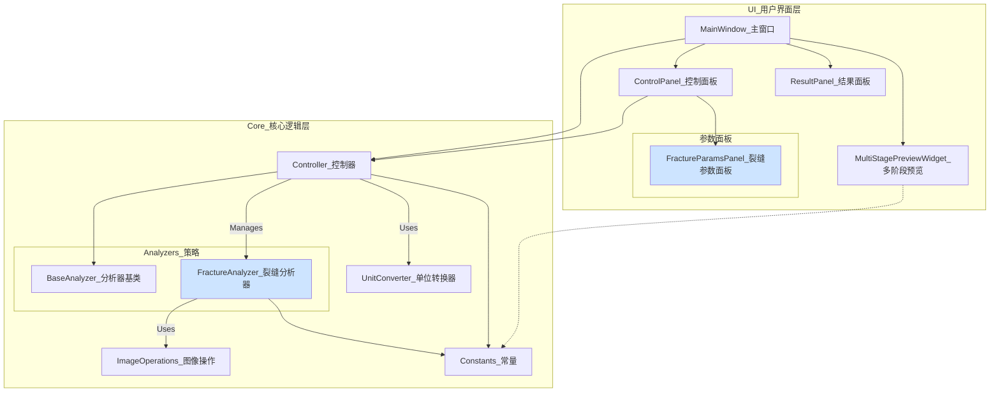
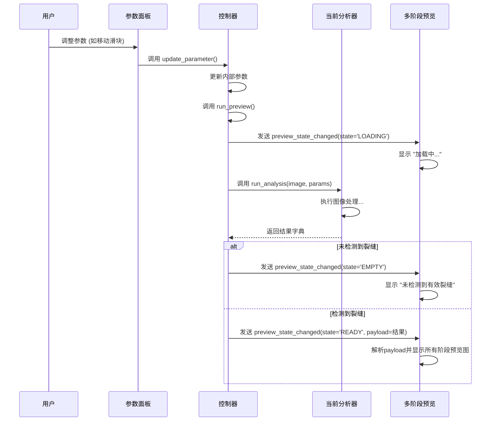

# Mermaid 图表

本文档包含了项目的主要架构图和流程图，使用Mermaid语法绘制。

## 1. 系统架构图 (System Architecture)

该图展示了应用的主要组件分层和它们之间的依赖关系。

## 2. 实时预览数据流 (Real-time Preview Data Flow)

该序列图详细描述了当用户调整参数时，系统内部的数据流动和方法调用顺序，以实现状态驱动的实时预览。

