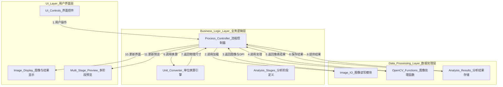

# 岩心裂缝分析软件

## 项目简介

岩心裂缝分析软件是一个轻量级的桌面应用程序，旨在自动化识别和量化分析岩心图像中的裂缝。它提供了一套完整的交互式工具，用户可以从加载图像开始，通过实时参数调优，最终获得精确的物理分析数据。

## 功能特点

- **多格式图像支持**: 支持加载 `.jpg`, `.png`, `.bmp` 等常用图像格式，并能自动从元数据中读取DPI信息用于物理单位换算。
- **高级裂缝识别**:
    - **多种阈值算法**: 提供全局阈值、Otsu、自适应高斯、Niblack、Sauvola等多种业界标准算法。
    - **精细形态学控制**: 用户可通过独立对话框微调开/闭运算等形态学参数。
    - **智能轮廓合并**: 可选的智能合并功能，用于连接邻近的断裂轮廓，使分析更符合实际。
- **实时参数调优与预览**:
    - 任何参数（如阈值、形态学）的调整都会**实时**反映在多阶段预览窗口中。
    - 用户可以并排查看原始图像、灰度图、二值化图和形态学处理后的效果，直观地理解每个参数的作用。
- **向导式定量分析**:
    - 通过分析向导，用户可以在分析前设定物理过滤条件（如最小裂缝长度、最小长宽比），以排除噪声和不相关的细节。
    - 最终计算裂缝的核心物理参数：数量、总面积(mm²)、总长度(mm)。
- **手动测量工具**: 提供一个简单的手动测量工具，用户可以在图像上绘制直线以快速测量任意两点间的物理距离。

## 安装与运行

1.  **克隆仓库**:
    ```bash
    git clone <your-repo-url>
    cd rock-fracture-analyzer
    ```

2.  **创建虚拟环境 (推荐)**:
    ```bash
    python -m venv venv
    source venv/bin/activate  # on Windows, use `venv\Scripts\activate`
    ```

3.  **安装依赖**:
    项目的所有依赖都已在 `requirements.txt` 文件中列出。运行以下命令进行安装：
    ```bash
    pip install -r requirements.txt
    ```

4.  **运行程序**:
    ```bash
    python run.py
    ```

## 技术架构

本软件采用**分层架构**，将应用程序在逻辑上划分为三个独立的层次：

1. **用户界面层 (UI Layer)**：负责所有与用户交互的界面元素，包括窗口、按钮、滑块等，展示图像和分析数据。该层的详细文档请参见 `src/app/ui/README.md`。

2. **业务逻辑层 (Business Logic Layer)**：充当UI层和数据处理层之间的"指挥官"，接收UI层的请求，调用数据处理层的功能，并将结果传递回UI层。

3. **数据处理层 (Data Processing Layer)**：包含所有底层的计算任务，封装了所有与OpenCV和NumPy相关的函数，如图像读取、滤波、参数计算等。

业务逻辑层与数据处理层的代码位于 `src/app/core` 目录中，其详细架构说明请参见 `src/app/core/README.md`。

**架构图:**


**技术栈**：
- 编程语言: Python 3.11
- GUI框架: PyQt5
- 核心图像处理库: OpenCV-Python
- 数值计算库: NumPy

## 分析阶段

软件定义了以下分析处理阶段:

1. **原始图像 (ORIGINAL)**: 加载的原始岩心图像
2. **灰度处理 (GRAYSCALE)**: 转换为灰度图的处理结果
3. **阈值分割 (THRESHOLD)**: 二值化后的黑白图像
4. **形态学处理 (MORPHOLOGY)**: 应用开闭运算后的形态学处理结果
5. **裂缝检测 (DETECTION)**: 检测到的裂缝轮廓
6. **测量结果 (MEASUREMENT)**: 最终的测量数据和标注结果

