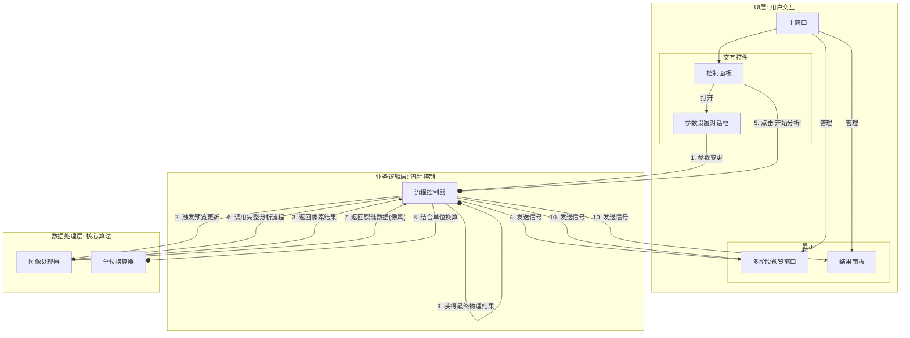

# 岩心裂缝分析软件

## 项目简介

**岩心裂缝分析软件**是一个轻量级的桌面应用程序，旨在自动化识别和量化分析岩心图像中的裂缝。它提供了一套完整的交互式工具，用户可以从加载图像开始，通过实时参数调优，最终获得精确的物理分析数据和可视化结果。

## 功能特点

- **多格式图像支持**: 支持加载 `.jpg`, `.png`, `.bmp` 等常用图像格式，并能自动从元数据中读取DPI信息用于物理单位换算。
- **高级裂缝识别**:
    - **多种阈值算法**: 提供全局阈值、Otsu、自适应高斯、以及更适用于不均匀光照的Niblack和Sauvola算法。
    - **精细形态学控制**: 用户可通过独立对话框微调开/闭运算的核大小、形状及迭代次数。
    - **智能轮廓过滤**: 可根据物理单位（如最小长度mm）和几何形态（如最小长宽比）对检测到的轮廓进行精确过滤。
    - **智能轮廓合并**: (待实现) 可选的智能合并功能，用于连接邻近的断裂轮廓。
- **实时参数调优与预览**:
    - 任何参数（如阈值、形态学）的调整都会**实时**反映在多阶段预览窗口中。
    - 用户可以并排查看原始图像、灰度图、二值化图和形态学处理后的效果，直观地理解每个参数的作用。
- **参数化定量分析**:
    - **模块化参数面板**: 将复杂的参数设置移至独立的对话框中（二值化、形态学、过滤与合并），保持主界面整洁。
    - **一键分析**: 配置完成后，点击一下即可完成从裂缝识别到物理参数计算的全过程，输出包括：裂缝数量、总面积(mm²)、总长度(mm)，以及每条裂缝的详细数据。
- **手动测量工具**: (待实现) 提供一个简单的手动测量工具，用户可以在图像上绘制直线以快速测量任意两点间的物理距离。
- **参数导入/导出**:
    - 支持将整套分析配置保存为JSON文件，方便重复使用和分享。
    - 可以随时加载之前保存的参数，一键恢复分析环境。

## 安装与运行

1.  **克隆仓库**:
    ```bash
    git clone <your-repo-url>
    cd rock-fracture-analyzer
    ```

2.  **创建虚拟环境 (推荐)**:
    ```bash
    python -m venv venv
    source venv/bin/activate  # 在Windows上, 使用 `venv\Scripts\activate`
    ```

3.  **安装依赖**:
    项目的所有依赖都已在 `requirements.txt` 文件中列出。运行以下命令进行安装：
    ```bash
    pip install -r requirements.txt
    ```

4.  **运行程序**:
    ```bash
    python run.py
    ```

## 技术架构

本软件采用**分层架构**，将应用程序在逻辑上划分为三个独立的层次：

1.  **用户界面层 (UI Layer)**：负责所有与用户交互的界面元素，包括窗口、按钮、滑块等，并展示图像和分析数据。该层的详细文档请参见 `src/app/ui/README.md`。

2.  **业务逻辑层 (Business Logic Layer)**：充当UI层和数据处理层之间的"指挥官"，通过**信号与槽机制**进行解耦。它接收UI层的事件，调用数据处理层的功能，并将结果传递回UI层。

3.  **数据处理层 (Data Processing Layer)**：包含所有底层的计算任务，封装了所有与OpenCV和NumPy相关的函数，如图像读取、滤波、裂缝检测和参数计算等。

业务逻辑层与数据处理层的代码位于 `src/app/core` 目录中，其详细架构说明请参见 `src/app/core/README.md`。

**架构图:**


**技术栈**:
-   **语言**: Python 3.x
-   **GUI框架**: PyQt5
-   **核心图像处理**: OpenCV-Python, scikit-image
-   **数值计算**: NumPy

## 分析阶段

软件定义了以下分析处理阶段:

1.  **原始图像 (ORIGINAL)**: 加载的原始岩心图像。
2.  **灰度处理 (GRAYSCALE)**: 转换为灰度图并去噪的结果。
3.  **阈值分割 (THRESHOLD)**: 二值化后的黑白图像。
4.  **形态学处理 (MORPHOLOGY)**: 应用开/闭运算后的形态学处理结果。
5.  **裂缝检测 (DETECTION)**: 在原图上将识别出的裂缝轮廓用颜色标记出来的可视化结果。
6.  **测量结果 (MEASUREMENT)**: 对所有检测出的裂缝进行定量计算后得到的结构化数据，包括数量、总长度、总面积等。

