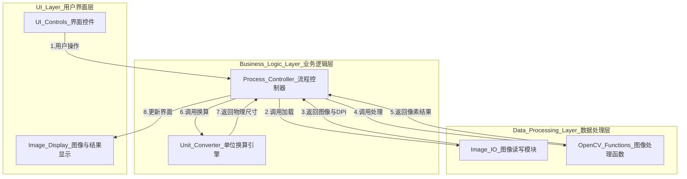

# 岩心裂缝分析软件

## 项目简介

岩心裂缝分析软件是一个轻量级桌面工具，用于自动识别岩心图像中的裂缝，并进行定量的物理参数分析。该软件作为课程作业开发，主要功能包括加载岩心图像、自动读取DPI信息、通过图像处理识别裂缝、提供手动测量工具，并展示分析结果。

## 功能特点

- **图像加载与处理**：支持加载.jpg、.png、.bmp格式图像，自动读取DPI信息
- **裂缝自动识别**：通过灰度化、去噪、阈值分割和形态学处理自动识别裂缝
- **参数量化分析**：计算裂缝数量、总面积(mm²)、总长度(mm)等物理参数
- **手动测量工具**：支持在图像上通过鼠标绘制直线进行手动测量
- **结果可视化**：将识别的裂缝区域以醒目颜色叠加显示在原图上
- **单位换算**：基于图像DPI信息，自动将像素单位转换为物理单位(mm)

## 技术架构

本软件采用**分层架构**，将应用程序在逻辑上划分为三个独立的层次：

1. **用户界面层 (UI Layer)**：负责所有与用户交互的界面元素，包括窗口、按钮、滑块等，展示图像和分析数据。

2. **业务逻辑层 (Business Logic Layer)**：充当UI层和数据处理层之间的"指挥官"，接收UI层的请求，调用数据处理层的功能，并将结果传递回UI层。

3. **数据处理层 (Data Processing Layer)**：包含所有底层的计算任务，封装了所有与OpenCV和NumPy相关的函数，如图像读取、滤波、参数计算等。

**架构图:**

**技术栈**：
- 编程语言: Python 3.11
- GUI框架: PyQt5
- 核心图像处理库: OpenCV-Python
- 数值计算库: NumPy

