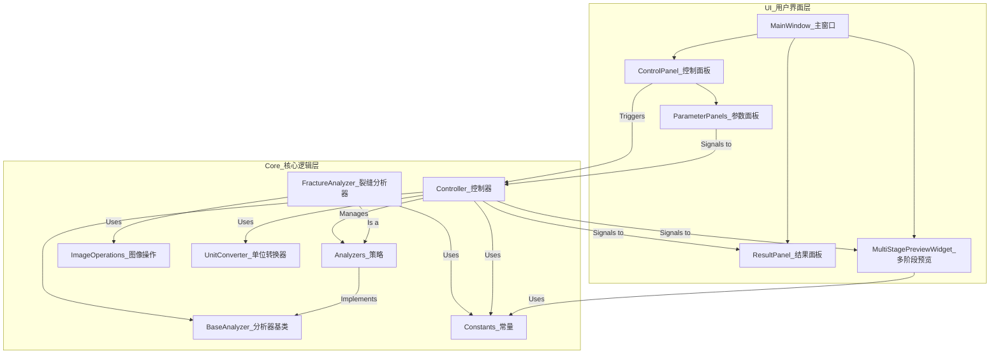

# 岩心裂缝分析软件

## 项目简介

**岩心裂缝分析软件**是一个轻量级的桌面应用程序，旨在自动化识别和量化分析岩心图像中的裂缝。它提供了一套完整的交互式工具，用户可以从加载图像开始，通过实时参数调优，最终获得精确的物理分析数据和可视化结果。

## 功能特点

- **多格式图像支持**: 支持加载 `.jpg`, `.png`, `.bmp` 等常用图像格式，并能自动从元数据中读取DPI信息用于物理单位换算。
- **高级裂缝识别**:
    - **多种阈值算法**: 提供全局阈值、Otsu、自适应高斯、以及更适用于不均匀光照的Niblack和Sauvola算法。
    - **精细形态学控制**: 用户可通过独立对话框微调开/闭运算的核大小、形状及迭代次数。
    - **智能轮廓过滤**: 可根据物理单位（如最小长度mm）和几何形态（如最小长宽比）对检测到的轮廓进行精确过滤。
    - **智能轮廓合并**: (待实现) 可选的智能合并功能，用于连接邻近的断裂轮廓。
- **状态驱动的实时预览**:
    - 任何参数调整都会触发一次完整的分析预览。
    - UI能够智能地展示当前分析状态：如"加载中"、"未检测到结果"或"就绪"。
    - 当分析就绪时，用户可以在一个多标签页视图中，清晰地查看原始图像、灰度图、二值化图、形态学处理后以及最终标记的**所有**中间阶段结果。
- **参数化定量分析**:
    - **模块化参数面板**: 复杂的参数设置被封装在独立的面板中，保持主界面整洁。
    - **一键分析**: 配置完成后，点击一下即可完成从裂缝识别到物理参数计算的全过程，输出包括：裂缝数量、总面积(mm²)、总长度(mm)，以及每条裂缝的详细数据。
- **手动测量工具**: (待实现) 提供一个简单的手动测量工具，用户可以在图像上绘制直线以快速测量任意两点间的物理距离。
- **参数导入/导出**:
    - 支持将整套分析配置保存为JSON文件，方便重复使用和分享。
    - 可以随时加载之前保存的参数，一键恢复分析环境。

## 安装与运行

1.  **克隆仓库**:
    ```bash
    git clone <your-repo-url>
    cd rock-fracture-analyzer
    ```

2.  **创建虚拟环境 (推荐)**:
    ```bash
    python -m venv venv
    source venv/bin/activate  # 在Windows上, 使用 `venv\Scripts\activate`
    ```

3.  **安装依赖**:
    项目的所有依赖都已在 `requirements.txt` 文件中列出。运行以下命令进行安装：
    ```bash
    pip install -r requirements.txt
    ```

4.  **运行程序**:
    ```bash
    python run.py
    ```

## 技术架构

本软件采用基于**策略设计模式 (Strategy Pattern)** 的分层架构，将不同的分析类型（如裂缝、孔洞）解耦为可互换的**分析器 (Analyzer)**。

1.  **用户界面层 (UI Layer)**：负责所有用户交互。`ControlPanel` 提供一个下拉框来选择分析策略，并动态加载该策略对应的参数面板。
2.  **业务逻辑层 (Business Logic Layer)**：由`Controller`担当，它作为UI和数据层之间的协调者。它管理着所有可用的分析器，并根据用户的选择设置当前激活的分析器。它不关心分析的具体实现，只负责调用激活分析器的接口。
3.  **策略/数据处理层 (Strategy/Data Layer)**：由一系列实现`BaseAnalyzer`接口的**具体分析器**组成。每个分析器（如`FractureAnalyzer`）都封装了特定类型分析所需的全套算法、参数和处理流水线。

这种架构使得添加新的分析功能变得非常容易，只需创建一个新的分析器类和一个对应的UI参数面板即可。

**架构图:**


**技术栈**:
-   **语言**: Python 3.x
-   **GUI框架**: PyQt5
-   **核心图像处理**: OpenCV-Python, scikit-image
-   **数值计算**: NumPy

## 数据与状态

- **数据结构**: 软件的核心数据交换格式是一个字典，其键名由一个中央`constants.py`文件统一定义。这确保了从数据分析到UI展示的各个环节中，数据字段的一致性和稳定性。
- **预览状态**: 预览的更新机制是**状态驱动**的。`Controller`在处理后，会发送一个包含当前状态（如 `LOADING`, `READY`, `EMPTY`）的信号。UI层的`MultiStagePreviewWidget`接收此信号后，会根据具体状态来决定如何展示，是将所有处理阶段的图像在标签页中一一呈现，还是显示"加载中"或"无结果"的提示。

