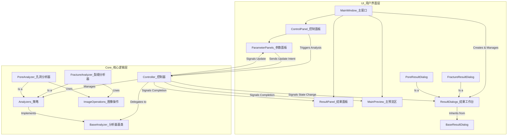

# 岩心裂缝与孔洞分析软件

## 项目简介

**岩心裂缝与孔洞分析软件**是一个轻量级的桌面应用程序，旨在自动化识别和量化分析岩心图像中的裂缝与孔洞。它提供了一套完整的交互式工具，用户可以从加载图像开始，通过实时参数调优，最终获得精确的物理分析数据和可视化结果。

## 功能特点

- **多格式图像支持**: 支持加载 `.jpg`, `.png`, `.bmp` 等常用图像格式，并能自动从元数据中读取DPI信息用于物理单位换算。
- **双重分析能力**:
    - **高级裂缝识别**:
        - **多种阈值算法**: 提供全局阈值、Otsu、自适应高斯、以及更适用于不均匀光照的Niblack和Sauvola算法。
        - **精细形态学控制**: 用户可通过独立对话框微调开/闭运算的核大小、形状及迭代次数。
        - **智能轮廓过滤**: 可根据物理单位（如最小长度mm）和几何形态（如最小长宽比）对检测到的轮廓进行精确过滤。
        - **智能轮廓合并**: (新) 可根据最大距离和角度差，自动合并断裂的裂缝，提高分析的准确性。
    - **高级孔洞识别**:
        - **分水岭算法**: 采用先进的分水岭算法，能有效分割粘连的孔洞，确保计数和形态分析的准确性。
        - **多种阈值算法**: (新) 与裂缝分析一致，支持包括Otsu、Sauvola在内的多种二值化算法，以适应不同光照条件。
        - **科学的筛选标准**: 基于面积和坚实度(Solidity)进行筛选，比传统的圆度筛选更具鲁棒性，能准确识别各种形状的孔洞。
- **智能实时预览**:
    - **选择性实时预览**: 系统根据参数的ui_hints.realtime属性决定是否在参数变更时自动触发预览更新。
    - **状态驱动的UI**: 主窗口旁的**结果工作台**能够智能地展示当前分析状态：如"加载中"、"未检测到结果"或"就绪"。
    - 当分析就绪时，用户可以在一个独立的、多标签的"实时工作台"窗口中，清晰地查看包括灰度图、二值化图、形态学处理后等**所有**中间阶段结果。
- **参数化定量分析**:
    - **模块化参数面板**: UI会根据所选分析模式（裂缝/孔洞）动态加载专属的参数面板，保持界面整洁。
    - **一键分析**: 配置完成后，点击一下即可完成从目标识别到物理参数计算的全过程。
- **手动测量工具**: (待实现) 提供一个简单的手动测量工具，用户可以在图像上绘制直线以快速测量任意两点间的物理距离。
- **参数导入/导出**:
    - 支持将整套分析配置保存为JSON文件，方便重复使用和分享。
    - 可以随时加载之前保存的参数，一键恢复分析环境。

## 安装与运行

1.  **克隆仓库**:
    ```bash
    git clone <your-repo-url>
    cd rock-fracture-analyzer
    ```

2.  **创建虚拟环境 (推荐)**:
    ```bash
    python -m venv venv
    source venv/bin/activate  # 在Windows上, 使用 `venv\Scripts\activate`
    ```

3.  **安装依赖**:
    项目的所有依赖都已在 `requirements.txt` 文件中列出。运行以下命令进行安装：
    ```bash
    pip install -r requirements.txt
    ```

4.  **运行程序**:
    ```bash
    python run.py
    ```

## 技术架构

本软件采用基于**策略设计模式 (Strategy Pattern)** 的分层架构，并通过**分析器驱动的参数与预览模型**来确保数据流的稳定性和可维护性。

1.  **用户界面层 (UI Layer)**：负责所有用户交互。
    - **`ControlPanel`** 提供一个下拉框来选择分析策略（裂缝/孔洞），并动态加载该策略对应的参数面板。
    - **参数对话框** (如 `ThresholdSettingsDialog`) 负责接收用户输入，并将用户的修改意图**告知** `Controller`。
    - **结果工作台 (`FractureResultDialog`, `PoreResultDialog`)**: 这些继承自 `BaseResultDialog` 的独立窗口，负责实时展示所有中间和最终的图像结果。

2.  **业务逻辑层 (Business Logic Layer)**：由`Controller`担当，它作为UI和数据层之间的协调者。
    - **参数的唯一事实来源**: `Controller` 维护着所有分析参数的当前状态。它是参数的"唯一修改入口"。
    - **分析器驱动**: `Controller` 不再包含任何特定于裂缝或孔洞的业务逻辑。它将所有分析、结果判空、单位转换等任务，全部委托给当前激活的`Analyzer`。
    - **统一更新机制**: 当参数被修改后，`Controller` 会发射一个统一的 `parameters_updated` 信号，通知所有相关的UI组件进行同步。
    - **选择性实时预览**: `Controller`根据参数的`ui_hints.realtime`属性决定是否在参数变更时自动触发预览更新，并将包含所有预览图像的载荷发送出去。

3.  **策略/数据处理层 (Strategy/Data Layer)**：由一系列实现`BaseAnalyzer`接口的**具体分析器**组成。每个分析器（如`FractureAnalyzer`, `PoreAnalyzer`）都封装了特定类型分析所需的全套算法、参数、预览策略和后处理逻辑。

这种架构健壮且易于扩展。它通过集中的参数管理和清晰的单向数据流（`UI -> Controller -> 结果工作台`），以及将业务决策权完全下放到`Analyzer`，从根本上解决了旧版本中存在的 `TypeError` 和递归更新问题，并为未来添加更多分析模块奠定了坚实的基础。

**架构图:**


**技术栈**:
-   **语言**: Python 3.x
-   **GUI框架**: PyQt5
-   **核心图像处理**: OpenCV-Python, scikit-image, SciPy
-   **数值计算**: NumPy

## 数据与状态

- **数据结构**: 软件的核心数据交换格式是一个字典，其键名由一个中央`constants.py`文件统一定义。这确保了从数据分析到UI展示的各个环节中，数据字段的一致性和稳定性。
- **参数数据流**: 
    1.  UI控件的用户输入触发一个信号。
    2.  参数对话框根据`Analyzer`提供的`ui_hints`元数据，判断是否需要发射`realtime_preview_requested`信号。
    3.  同时，`parameter_changed`信号被发射，告知`ControlPanel`。
    4.  `ControlPanel` 调用 `controller.update_parameter(key, value)`。
    5.  `Controller` 更新其内部维护的参数字典，然后检查该参数的`ui_hints.realtime`属性。
    6.  如果参数需要实时预览，`Controller`会调用`run_preview()`方法，该方法会发出包含所有中间预览图的 `preview_state_changed` 信号。
    7.  `MainWindow`捕获此信号，并调用当前**结果工作台**的 `update_content` 方法，实现实时、多标签的预览。
    8.  同时，`Controller`也会发射 `parameters_updated` 信号，所有相关的UI组件（如参数面板自身）监听此信号并同步显示，完成一个封闭且无递归风险的循环。
- **预览状态**: 预览的更新机制是**状态驱动**的。`Controller`在调用`Analyzer`处理后，会发送一个包含当前状态（如 `LOADING`, `READY`, `EMPTY`）和相应载荷的信号。UI层的**结果工作台**接收此信号后，会根据具体状态来决定是显示加载/空状态信息，还是显示包含所有图像的标签页。

