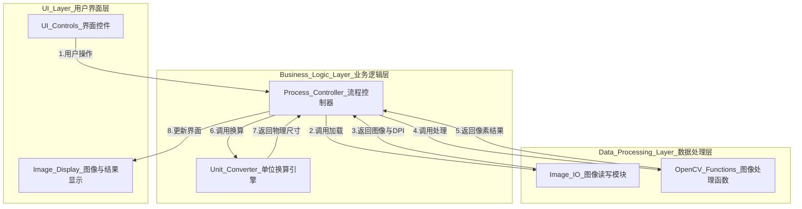

# 《岩心裂缝分析软件》需求规格说明书 (V1.4)

## 1. 引言

### 1.1. 项目目的
本文档旨在详细定义《岩心裂缝分析软件》的功能需求。该软件是为完成课程作业而开发的轻量级桌面工具，用于自动识别岩心图像中的裂缝，并进行定量的物理参数分析。

### 1.2. 项目范围
本项目将开发一个独立的桌面应用程序。其核心功能包括：加载岩心图像、自动读取DPI信息、通过图像处理识别裂缝、提供手动测量工具，并展示分析结果。软件将采用分层架构以保证代码的清晰度和可维护性。

## 2. 技术架构

### 2.1. 总体架构
本软件采用**分层架构**，将应用程序在逻辑上划分为三个独立的层次：用户界面层、业务逻辑层和数据处理层。这种设计模式可以实现关注点分离，使得代码结构清晰、易于维护和测试。

**架构图:**

### 2.2. 各层级说明
*   **用户界面层 (UI Layer)**: 负责所有与用户交互的界面元素。它构建窗口、按钮和滑块，展示图像和分析数据。它将用户的操作（如点击按钮、画线）传递给业务逻辑层，但不包含任何核心计算逻辑。
*   **业务逻辑层 (Business Logic Layer)**: 充当UI层和数据处理层之间的“指挥官”。它接收UI层的请求，按预定顺序调用数据处理层的原子功能，并对返回的数据进行整合，最后将格式化的结果传递回UI层进行显示。
*   **数据处理层 (Data Processing Layer)**: 包含所有底层的、纯粹的计算任务。这一层封装了所有与OpenCV和NumPy相关的函数，例如图像读取、滤波、参数计算等。

### 2.3. 技术选型
*   **编程语言**: Python 3.11
*   **GUI框架**: PyQt5 
*   **核心图像处理库**: OpenCV-Python
*   **数值计算库**: NumPy

## 3. 功能性需求

### 3.1. 需求汇总表

| 功能模块 | 需求ID | 需求描述 | 优先级 | **完成状态** | 验收标准 / 备注 |
| :--- | :--- | :--- | :--- | :--- | :--- |
| **用户界面 (UI)** | UI-01 | **主应用窗口**：提供一个标准的GUI窗口作为所有功能的容器。 | **必须实现** | **未开始** | 软件启动后，显示一个包含所有控件的窗口。 |
| | UI-02 | **图像显示区**：在主窗口中有一个专门的区域，用于显示加载的岩心图像。 | **必须实现** | **未开始** | 加载图像后，图像会显示在此区域。 |
| | UI-03 | **控制面板**：提供一个交互区域，包含按钮和滑块。 | **必须实现** | **未开始** | 包含“加载图像”、“开始分析”按钮和一个0-255的阈值调节滑块。 |
| | UI-04 | **结果展示区**：提供一个专门的文本区域，用于显示最终的分析结果。 | **必须实现** | **未开始** | 分析完成后，此区域会显示裂缝数量、总面积（mm²）、总长度（mm）。 |
| | **UI-05** | **手动直线测量工具**：提供一个工具，允许用户在图像上通过鼠标画一条直线。 | **必须实现** | **未开始** | 1. 界面上有一个“测量”按钮用于激活/取消此功能。 2. 功能激活后，用户可在图像上通过点击-拖拽-释放的方式画线。 3. 绘制的直线应在图像上实时可见。 |
| **核心功能** | CORE-01 | **图像加载**：用户可以通过按钮从本地文件系统选择并加载图像。 | **必须实现** | **未开始** | 支持.jpg, .png, .bmp格式。 |
| | CORE-02 | **DPI信息自动读取**：软件在加载图像时，自动读取文件内嵌的DPI信息。 | **必须实现** | **未开始** |  |
| | CORE-03 | **单位换算**：基于读取到的DPI值，将像素单位转换为物理单位（毫米）。 | **必须实现** | **未开始** | 确保所有输出的测量值都具有真实的物理意义。 |
| | CORE-04 | **图像分析流程**：点击“开始分析”按钮后，按顺序自动执行所有图像处理步骤。 | **必须实现** | **未开始** | 依次执行CORE-05至CORE-07的步骤。 |
| | CORE-05 | **1. 灰度化与去噪**：将图像转换为灰度图，并应用高斯滤波减少噪点。 | **必须实现** | **未开始** | 这是分析的第一步。 |
| | CORE-06 | **2. 阈值分割**：根据用户设定的阈值，将图像转换为二值图。 | **必须实现** | **未开始** | 阈值滑块的调整应能实时预览分割效果。 |
| | CORE-07 | **3. 形态学后处理**：对二值图像依次执行开运算和闭运算。 | **必须实现** | **未开始** | 用于提升结果质量，产出干净的裂缝形态。 |
| **分析与输出** | AN-01 | **定量参数计算**：计算最终裂缝形态的关键物理参数。 | **必须实现** | **未开始** | 必须计算并输出：裂缝数量、总面积（mm²）、总长度（mm）。 |
| | AN-02 | **结果可视化**：将识别出的裂缝区域，以醒目的颜色叠加显示在原图上。 | **必须实现** | **未开始** | 用户可以直观地对比识别结果与原图。 |
| | **AN-03** | **手动测量结果计算与显示**：在用户完成画线后，计算并显示该直线的属性。 | **必须实现** | **未开始** | 必须在一个弹出窗口或状态栏中清晰地显示以下三项信息： 1. 直线长度（单位：像素） 2. 图像DPI值 3. 物理长度（单位：毫米） |

*注：**完成状态** 可选值：`未开始`, `进行中`, `已完成`。*